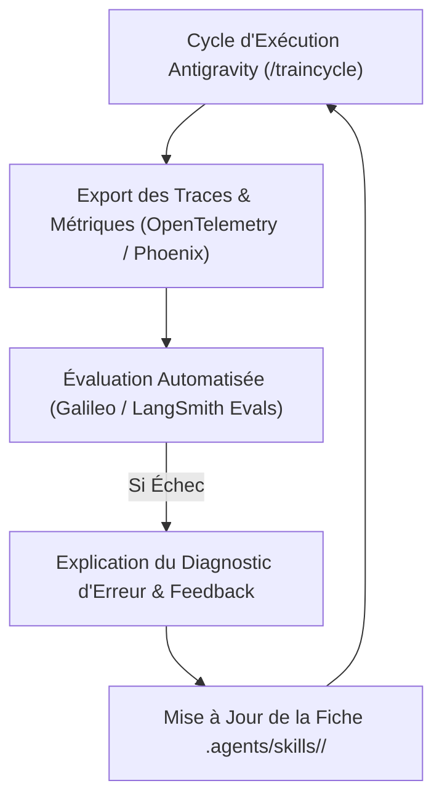

# 📊 Guide & Intégration Observabilité, Evals et Monitoring Multi-Agents

Ce document définit la stratégie d'intégration d'outils d'évaluation externes (**Galileo**, **Arize Phoenix**, **LangSmith**) et de télémétrie **OpenTelemetry** au sein du *harness* de **Google Antigravity**.

---

## 1. Pourquoi une Infrastructure d'Évaluation Dédiée ?

Les systèmes multi-agents présentent un taux d'échec élevé (entre 41% et 86,7% sans infrastructure d'évaluation appropriée) et génèrent un surcoût en tokens de 4 à 15 fois supérieur aux systèmes à agent unique. Les journaux traditionnels indiquant des exécutions réussies peuvent masquer de véritables défaillances de coordination ou de corruption de données.

L'implémentation de garde-fous (*guardrails*) et d'évaluations (*evals*) permet de :
- **Guardrails (Temps Réel)** : Contraindre le comportement en code (ex: interdire les appels d'outils non autorisés, filtrer le PII, stopper les injections).
- **Evals (A posteriori & Continu)** : Évaluer la qualité du raisonnement, la fidélité aux instructions et la pertinence des résultats.
- **Feedback Loops** : Transformer les explications d'échecs capturées en production en briefs d'ingénierie pour mettre à jour les fiches `.agents/skills/` de l'équipe.

---

## 2. Métriques Clés de Coordination Multi-Agents

| Catégorie | Métrique | Description & Utilité |
| :--- | :--- | :--- |
| **Précision des Outils** | *Tool Selection Accuracy & Quality* | Mesure si l'agent a sélectionné l'outil approprié avec des arguments valides. |
| **Adhérence et Cohérence** | *Agent Adherence & Context Adherence* | Évalue si l'agent respecte son rôle et les contraintes spécifiées sans dérive. |
| **Cadre CLEAR (Arize Phoenix)** | *Cost, Latency, Efficacy, Assurance, Reliability* | Analyse globale du coût en tokens, de la latence par étape, de l'efficacité et de la fiabilité des *hand-offs*. |
| **Qualité des Transmissions** | *Handoff Success Rate & Drift Detection* | Vérifie si la structure de données transmise par l'agent A correspond aux attentes de l'agent B. |
| **Évaluation Multi-tours** | *Multi-turn Evals* | Évalue l'accomplissement de l'objectif sur l'ensemble de la conversation plutôt que sur une seule étape. |

---

## 3. Configuration des Connecteurs d'Observabilité

### A. Galileo (Galileo Protect & Insights Engine)
Galileo s'intègre via OpenTelemetry et des variables d'environnement. Il utilise les modèles légers *Luna-2* pour évaluer continuellement les trajectoires sans surcoût excessif :
```bash
# Variables d'environnement pour l'intégration Galileo
export GALILEO_API_KEY="votre_cle_api_galileo"
export GALILEO_PROJECT="antigravity-multi-agent-traincycle"
export GALILEO_ENABLE_PROTECT="true"
```
- **Insights Engine** : Regroupe automatiquement les pannes de coordination similaires en quelques minutes.
- **Galileo Protect** : Bloque les sorties insécurisées, les fuites de PII et les hallucinations avant impact.

### B. Arize Phoenix (Tracing Distribué OpenSource)
Arize Phoenix offre un suivi distribué compatible OpenTelemetry pour analyser la chaîne de dépendances entre superviseur et sous-agents :
```bash
# Activation du Tracing OpenTelemetry vers Arize Phoenix
export PHOENIX_COLLECTOR_ENDPOINT="http://localhost:6006/v1/traces"
export PHOENIX_PROJECT_NAME="antigravity-simulation"
```

### C. LangSmith (Observabilité & Thread Evals)
LangSmith permet d'activer la collecte automatique de traces multi-tours sans modification de code applicatif :
```bash
# Activation directe de LangSmith
export LANGSMITH_TRACING="true"
export LANGSMITH_API_KEY="votre_cle_api_langsmith"
export LANGSMITH_PROJECT="antigravity-coach-evals"
```

---

## 4. Intégration Native dans Antigravity (.agents/rules/coach_rules.md)

Inséré dans `.agents/rules/coach_rules.md` :
1. **Capture des Tracing Spans** : Chaque invocation de sous-agent (`invoke_subagent`) exporte ses métriques vers le collecteur OpenTelemetry.
2. **Traitement des Échecs d'Évaluation** : Extraction du diagnostic d'erreur et formulation d'un brief de correction par le `@coach`.
3. **Mise à Jour Automatique des Compétences** : Injection directe des correctifs dans `.agents/skills/<role>/SKILL.md`.

---

## 5. Boucle d'Auto-Amélioration (Self-Improvement Loop)



*Document généré pour la gouvernance, l'observabilité et le suivi de performance de l'équipe d'agents sur Google Antigravity.*