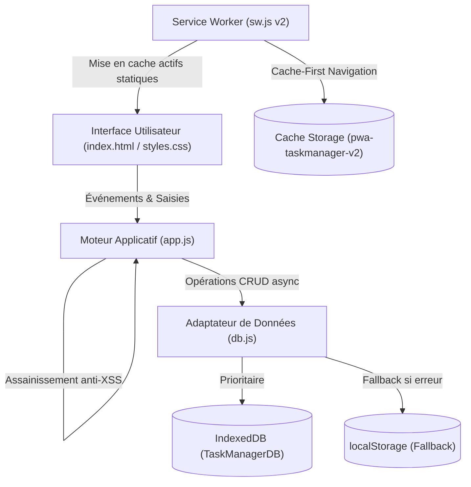

# 🏗️ Architecture Walkthrough — PWA Task Manager Offline-First

**Projet** : PWA Task Manager Offline-First avec IndexedDB  
**Auteurs** : `@DOC` (Tech Writer) & `@CE` (Architecte)  
**Revue Technique** : Validé conforme à `Technical_Specification.md`  

---

## 1. Vue d'Ensemble des Composants

---

## 2. Décisions d'Ingénierie & Patterns Appliqués

### A. Paradigme Local-First & Stockage Asynchrone (`db.js`)
L'application ne dépend d'aucun serveur distant pour fonctionner. Toute transaction IndexedDB est encapsulée dans des `Promise` avec gestion fine des erreurs (`onupgradeneeded`, `onsuccess`, `onerror`). En cas d'incompatibilité ou d'incident, un fallback synchrone vers `localStorage` avec sérialisation JSON garantit la continuité de service.

### B. Sécurité Anti-XSS by Design (`app.js`)
Suite à la première boucle de retravail déclenchée par `@AUD` et au coaching pédagogique de `@coach`, l'injection brute via `innerHTML` a été sécurisée par la fonction utilitaire `sanitizeHTML()`. Celle-ci utilise le navigateur lui-même pour créer un élément virtuel et extraire son contenu neutralisé, empêchant l'exécution de tout script arbitraire injecté dans les champs de saisie.

### C. Stratégie de Mise en Cache & Cycle de Vie PWA (`sw.js`)
Le Service Worker adopte une stratégie **Cache-First** pour l'intégralité des fichiers statiques de l'application. La version 2 intègre une boucle d'invalidation dans l'événement `activate` qui compare les caches existants avec `CACHE_NAME = 'pwa-taskmanager-v2'` et supprime instantanément toute ancienne version orpheline.

### D. Design System & Accessibilité Universelle (`styles.css`)
Conçu en CSS natif pur sans framework lourd (Tailwind ou Bootstrap), le style s'appuie sur des variables CSS, une grille responsive adaptative Mobile-First et respecte les critères d'accessibilité WCAG 2.1 AA / AAA (contraste > 4.5:1, indicateurs de focus visibles, navigation clavier intégrale).