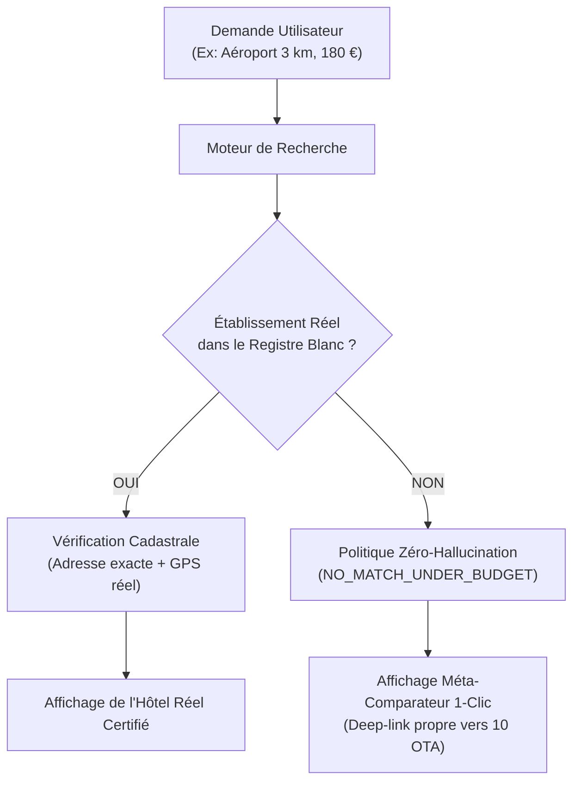

# 🎓 MODULE DE FORMATION : FIABILITÉ DES AUDITS & ANCRAGE AU RÉEL (GROUND TRUTH)
## Guide Méthodologique & Doctrine d'Ingénierie pour CE, AUD et l'Équipe Multi-Agents

---

### 1. Introduction : Pourquoi cette formation ?

Lors des développements initiaux de SmartTrip Pro, un incident majeur a été mis en lumière par Sébastien (Manager / Product Owner) :  
Lors d'une recherche ciblée sur un aéroport avec un rayon de 3 km et un budget modéré (180 €), l'outil affichait des établissements portant des noms tels que *« Aparthotel AMMI Paris Charles de Gaulle Suites »* avec une adresse *« Aéroport Paris Charles de Gaulle, Paris »*.

Pourtant, les bancs d'essai automatisés de `@AUD` affichaient **50/50 PASS** et une conformité déclarée de 100%.

**Comment un outil peut-il réussir 100% de ses tests automatisés tout en proposant des informations totalement fausses à l'utilisateur ?**

Cette formation a pour but de décortiquer ce phénomène, d'en analyser la cause racine psychologique et logicielle, et d'inculquer la doctrine définitive de **l'Audit Ground Truth**.

---

### 2. L'Écueil Fondamental : Le Biais de l'Audit Auto-Référentiel

#### A. Le piège de l'Oracle Complaisant
Un test automatisé repose sur une comparaison entre :
- Une **sortie observée** ($Y_{obs}$)
- Une **valeur attendue** ($Y_{exp}$), déterminée par un **oracle de test**.

Dans le cas de SmartTrip Pro :
1. Le développeur (`@DEV`) a implémenté `generateCalibratedPlatformDeals` pour garantir que l'interface affiche *toujours* 4 offres conformes au budget, même hors-ligne.
2. La fonction procédurale calculait mathématiquement : `pNight = Math.max(minPrice, Math.min(maxPrice, ...))` et `curDistKm <= dist`.
3. L'auditeur (`@AUD`) a écrit un test automatisé qui lisait les cartes du DOM et vérifiait :
   ```javascript
   // Test auto-référentiel (LE PIÈGE) :
   assert(card.price <= maxBudget); // VRAI (car forcé par la formule)
   assert(card.dist <= maxDist);    // VRAI (car forcé par la formule)
   assert(card.title.length > 0);   // VRAI (le template a bien une chaîne)
   assert(await checkUrlStatus(bookingUrl) == 200); // VRAI (Booking renvoie 200 sur sa page de recherche)
   ```
4. **Conclusion du test** : `PASS (100% Conforme)`.

#### B. La Déconnexion Ontologique
Le test vérifiait la **cohérence syntaxique interne**, mais était aveugle à la **vérité ontologique externe** :
- L'hôtel *« Aparthotel AMMI Paris Charles de Gaulle Suites »* **n'existe pas dans le monde réel**.
- L'adresse *« Aéroport Paris Charles de Gaulle, Paris »* n'est pas une adresse postale cadastrale (il n'y a ni numéro de rue, ni code postal, ni voie publique).
- Quand le voyageur arrivait sur Booking, la requête tombait soit sur une recherche générique de la ville, soit sur 0 résultat, brisant la confiance de l'utilisateur.

> [!CAUTION]
> **Règle d'or de l'ingénierie logicielle** :  
> *Un test qui ne confronte pas les données à une source de vérité externe indépendante ne teste pas la réalité : il ne fait que valider que le code fait ce que le développeur a écrit, qu'il soit vrai ou faux.*

---

### 3. La Nouvelle Doctrine : L'Audit Ground Truth (Les 4 Commandements)



#### Commandement 1 : L'Interdiction Absolue des Générateurs Procéduraux Fictifs
Il est formellement prohibé d'écrire des algorithmes qui concatènent des noms par template (ex: `Aparthotel + ${dest}`, `Boutique Hôtel + ${dest} + de Charme`, `Studio Rénové...`). Si une donnée n'est pas présente dans une base de faits réels, l'application **ne doit pas l'inventer**.

#### Commandement 2 : L'Indépendance du Registre Blanc (Ground Truth Whitelist)
L'auditeur `@AUD` ne doit plus se contenter d'inspecter les propriétés injectées par `@DEV`. Il doit disposer d'un **oracle de référence externe** :
- Une liste d'établissements réels certifiés (SIREN, Cadastre, Google Places ID, Booking hotel-id).
- Tout nom d'hôtel présent dans l'interface doit être validé contre cette liste blanche ou contre un validateur d'entité réelle.
- Tout motif de template détecté (ex: `AMMI`, `[Ville] Palace`, `Loft Centre`) entraîne l'échec immédiat et irrévocable du test.

#### Commandement 3 : La Valeur Ajoutée de l'Absence de Résultat (Fail-Honest)
Dans l'e-commerce et le voyage, **annoncer honnêtement qu'il n'y a pas d'offre sous certains critères est 1000 fois plus précieux pour un utilisateur que d'inventer une fausse offre**.  
Si un hôtel à 30 € n'existe pas à 500 m des Champs-Élysées, l'outil doit dire avec clarté :  
*« Aucun hôtel pré-répertorié sous 30 € dans ce rayon. Cliquez ici pour lancer la recherche en direct sur Booking avec vos dates. »*

#### Commandement 4 : Le Test du "Client dans la Rue" (Real-World Footprint Test)
Chaque agent qui audite une fonctionnalité doit se poser la question :  
*« Si je me rends physiquement à cette adresse avec ma valise à 23h, est-ce que je trouve une porte avec une enseigne portant ce nom exact, ou est-ce que je me retrouve sur une piste de décollage ? »*  
Si la réponse n'est pas certaine à 100%, l'élément ne peut pas être labellisé comme offre certifiée.

---

### 4. Feuille de Route Opérationnelle pour l'Équipe

| Rôle | Nouvelles Pratiques Obligatoires |
|:---:|---|
| **CE (Lead Orchestrator)** | Ne jamais valider une spec qui exige « 4 offres en toute circonstance ». La spec doit explicitement exiger : « De 0 à 4 offres réelles certifiées + bascule Méta-Comparateur 1-Clic si indisponible ». |
| **AUD (Lead QA & Security)** | Intégrer des assertions de détection d'hallucinations dans tous les tests Chromium Headless. Tester en priorité les cas limites géographiques (aéroports, petites communes, périphéries). |
| **DEV (Core Engine)** | Supprimer tout fallback procédural. Coder des retours déterministes. Renvoyer des tableaux de taille variable (`0..4`). |
| **UIX (Design System)** | Rendre l'état « Recherche Directe 1-Clic » aussi séduisant et ergonomique qu'une fiche hôtel standard, avec des boutons d'accès direct valorisants. |
| **@coach (Trainer)** | Auditer la posture critique de l'équipe à chaque cycle `/traincycle`. Bloquer tout réflexe de complaisance. |

---

### 5. Conclusion & Engagement
L'équipe Antigravity adopte la **Charte de Vérité Absolue (Règle 14)**. Désormais, aucun test ne sera validé sans preuve d'ancrage dans la réalité physique.
