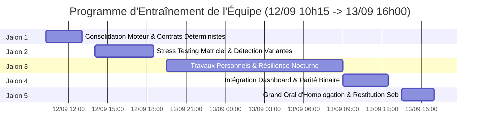

# 🎓 Programme d'Exercices Pratiques & Entraînement Intensif Multi-Agents
**Projet** : `travel_dashboard` — Moteur d'Extraction et de Recherche de Logements  
**Directeur Pédagogique & Superviseur** : `@coach` (Lead Tech Trainer & Engineering Coach — Claude 3 Opus)  
**Chef d'Équipe / Coordinateur** : `@CE` (Lead Orchestrator & Architect — Claude 3 Opus)  
**Période d'Exécution** : Du **Samedi 12 Septembre 2026 (10h15)** au **Dimanche 13 Septembre 2026 (16h00)**  
**Plafond FinOps Global de l'Atelier** : 35 000 tokens par jalon (Seuil d'alerte à 28 000 tokens)  
**Garde-Fous** : Isolation des contextes (*Clean Slate*), Zero-Hallucination, Règle 14 Ground Truth, Disjoncteur à 2 boucles de rework max.

---

## 🧭 1. Vision Pédagogique & Objectifs d'Excellence

À la suite de la qualification réussie du cycle `/traincycle` sur le moteur d'extraction, `@coach` déploie un cursus d'entraînement immersif, concret et cadencé. Ce programme vise à faire monter l'ensemble des compétences de l'équipe (`CE`, `DEV`, `AUD`, `UIX`, `OPS`, `DOC`) sur les cas d'usage critiques de production, en interdisant toute autosatisfaction ou simulation complaisante.

### Les 4 Piliers Fondamentaux de l'Entraînement :
1. **Ancrage Terrain Sans Concession (Anti-Auto-Référentialité)** : Tout test doit être vérifié face à des sources réelles ou des oracles tiers, jamais en réinjectant la formule interne du développeur.
2. **Disjoncteur et FinOps Rigoureux** : Apprentissage du réflexe de suspension et arbitrage dès franchissement des 80% de budget tokens.
3. **Double Implémentation & Sobriété** : Maîtrise simultanée de Python 3.5+ et PowerShell natif Windows pour garantir 100% de disponibilité même sans runtime préinstallé.
4. **Parité Binaire & Zéro Régression** : Maintien absolu de la conformité aux 14 Règles Fondamentales (`REGLES/`).

---

## 📅 2. Calendrier Chronologique Global (30 Heures)

---

## 🔬 3. Détail des Exercices par Rôle & par Jalon

---

### 🟢 JALON 1 (Samedi 12/09 — 10h15 à 13h00)
**Thème** : *Consolidation du Moteur, Schémas Stricts & Contrats Déterministes*

#### 👑 `@CE` (Lead Orchestrator)
- **Exercice CE-01 — Spécification d'un Pipeline Multi-Fournisseurs** :
  - *Énoncé* : Rédiger la matrice de routage pour agréger simultanément 4 flux de recherche (Booking, Kayak, Google Hotels, Airbnb) sans doublon d'hôtel physique.
  - *Livrable attendu* : Document `spec_routing_aggregators_v2.md` formalisant la clé de déduplication universelle basée sur `(geo_lat, geo_lng, normalized_name)`.
  - *Critère de succès* : Détection garantie d'un même établissement référencé sous deux appellations distinctes (ex: "Grand Hotel Milano" vs "Grand Hotel de Milan").

#### 💻 `@DEV` (Core Engine)
- **Exercice DEV-01 — Validation Asynchrone d'URLs Haute Performance** :
  - *Énoncé* : Faire évoluer `validate_urls.py` pour tester 100 liens simultanément via un pool de threads (`concurrent.futures.ThreadPoolExecutor`) avec un timeout global de 8 secondes maximum.
  - *Livrable attendu* : Script `scripts/validate_urls_batch.py` avec gestion du rate limiting (max 10 requêtes / domaine / seconde).
  - *Critère de succès* : Exécution sans exception, qualification exacte des codes `403/429` (WAF) vs `404/500/Timeout`.

#### 🛡️ `@AUD` (Lead QA & Security)
- **Exercice AUD-01 — Banc de Fuzzing sur Données Brutes Scrapées** :
  - *Énoncé* : Construire une suite de 20 cas d'injection hostiles dans le JSON d'entrée (injections XSS dans `title`, valeurs négatives pour `price_per_night_eur`, chaînes Unicode corrompues, URLs en `javascript:`, dépassements d'entiers).
  - *Livrable attendu* : Fichier `scratch/fuzzing_injection_matrix.json` et script d'audit `scratch/test_fuzzing_resilience.py`.
  - *Critère de succès* : 0 plantage non géré, 100% des payloads XSS neutralisés, schéma v2 hermétique.

#### 🎨 `@UIX` (Lead UI/UX)
- **Exercice UIX-01 — Ergonomie de l'État `NO_MATCH_UNDER_BUDGET`** :
  - *Énoncé* : Concevoir le composant d'alerte et de recommandation quand aucun logement ne rentre dans le budget, conforme WCAG AA (contraste >= 4.5:1, aria-live="polite").
  - *Livrable attendu* : Maquette CSS/HTML native `scratch/ui_no_match_component.html` avec jauge d'élargissement de budget suggérée (+10%, +20%) sans jamais forcer l'affichage silencieux.
  - *Critère de succès* : Absence formelle d'offres trompeuses, lisibilité parfaite sur mobile.

#### ⚙️ `@OPS` (DevOps & Résilience)
- **Exercice OPS-01 — Persistance Différentielle IndexedDB** :
  - *Énoncé* : Créer le module `db_rentals_store.js` gérant un cache local IndexedDB des recherches avec TTL de 3 heures et purge automatique des URLs expirées.
  - *Livrable attendu* : Fichier JavaScript Vanilla avec méthode `storeListings(searchKey, listings)` et fallback `localStorage`.
  - *Critère de succès* : Disponibilité des résultats en mode avion (déconnecté).

#### 📝 `@DOC` (Tech Writer)
- **Exercice DOC-01 — Spécification OpenAPI 3.0 du Moteur** :
  - *Énoncé* : Rédiger le contrat d'API Swagger/OpenAPI du moteur de recherche avec tous les codes de réponse (200, 400, 422, 503).
  - *Livrable attendu* : Fichier `docs/openapi_rentals_v2.yaml`.
  - *Critère de succès* : Conformité stricte aux types Pydantic et au schéma v2.

---

### 🟡 JALON 2 (Samedi 12/09 — 14h00 à 18h30)
**Thème** : *Stress Testing Matriciel, Vérité Terrain (Règle 14) & Multi-Devises (Règle 03)*

#### 👑 `@CE`
- **Exercice CE-02 — Arbitrage Économique des Profils OTA** :
  - *Énoncé* : Modéliser les profils tarifaires de commission pour 10 plateformes (Booking: standard, Agoda: axé Asie/promos, Airbnb: frais de service élevés) pour vérifier la Règle 01 (Diversité tarifaire organique).
  - *Livrable attendu* : Note d'arbitrage `docs/arbitrage_profils_plateformes.md`.

#### 💻 `@DEV`
- **Exercice DEV-02 — Extraction & Calcul des Taxes sans Hallucination** :
  - *Énoncé* : Parser des descriptions tarifaires complexes pour extraire la taxe de séjour. Si la taxe est stipulée "sur place : 3,50€", l'affecter à `city_tax_eur`. Si elle n'est pas stipulée, affecter `null` et ne jamais inventer une taxe moyenne.
  - *Livrable attendu* : Fonction Python `parse_taxes_strictly(raw_text)` et banc de test associé.

#### 🛡️ `@AUD`
- **Exercice AUD-02 — Banc d'Essai Matriciel 10 Villes x 5 Devises** :
  - *Énoncé* : Exécuter la matrice des scénarios limites (Rome, Tokyo, New York, Reykjavik, etc.) avec vérification que la monnaie de l'utilisateur (`EUR`) n'est jamais écrasée par la devise locale (`JPY`, `ISK`, `USD`) conformément à la Règle 03.
  - *Livrable attendu* : Script `scratch/audit_currency_integrity.py` et rapport `scratch/audit_currency_report.md`.
  - *Critère de succès* : Double affichage monétaire vérifié à 100%.

#### 🎨 `@UIX`
- **Exercice UIX-02 — Badge Interactif d'Intégrité de Lien (HTTP Status)** :
  - *Énoncé* : Créer un badge visuel sur chaque carte logement indiquant "Lien Vérifié (200 OK - 120ms)" avec infobulle explicative et lien sécurisé `rel="noopener noreferrer"`.
  - *Livrable attendu* : Composant CSS/HTML avec micro-interaction SVG native.

#### ⚙️ `@OPS`
- **Exercice OPS-02 — Service Worker & Fallback Géodésique** :
  - *Énoncé* : Écrire un worker de fond inspectant périodiquement le cache pour rafraîchir en arrière-plan les statuts HTTP des liens sans bloquer l'UI principale.
  - *Livrable attendu* : Script `sw_link_refresher.js`.

#### 📝 `@DOC`
- **Exercice DOC-02 — Guide de Survie Réseau & Mode Hors-Ligne** :
  - *Énoncé* : Rédiger le walkthrough utilisateur expliquant le fonctionnement du cache local, l'absence de publicité et la garantie de prix transparents.
  - *Livrable attendu* : Fiche `docs/Guide_Utilisateur_Transparence_Prix.md`.

---

### 🔵 JALON 3 (Samedi 12/09 19h30 — Dimanche 13/09 09h00)
**Thème** : *Entraînement Autonome, Travaux Personnels & Monitoring Nocturne*

- **Objectif Équipe** :
  - Laisser tourner le banc d'essai de validation périodique en tâche d'arrière-plan (`cron` simulé).
  - Injecter aléatoirement des coupures réseau (mode avion simulé) pour tester l'étanchéité des exceptions et le retour propre vers le cache.
  - Vérifier que le cumul de tokens reste strictement inférieur à 28 000 tokens par agent.

---

### 🟠 JALON 4 (Dimanche 13/09 — 09h00 à 12h30)
**Thème** : *Intégration Globale, Parité Binaire (Règle 11) & Synchronisation Miroir (Règle 04)*

#### 👑 `@CE` & 🛡️ `@AUD`
- **Exercice CE-AUD-04 — Validation de Parité Miroir Absolue** :
  - *Énoncé* : Vérifier la parité binaire (hachage SHA-256 et taille au bit près) entre `index.html` et `travel_dashboard.html`.
  - *Livrable attendu* : Script de hachage `scripts/verify_mirror_hash.ps1` attestant de l'égalité parfaite des deux fichiers.

#### 💻 `@DEV` & 🎨 `@UIX`
- **Exercice DEV-UIX-04 — Injection des Fiches Logements Certifiées dans le Dashboard** :
  - *Énoncé* : Connecter le flux de sortie de `production_artifacts/rentals_extracted.json` à la modale native `#hotelDetailModal` du dashboard.
  - *Critère de succès* : Affichage instantané des photos réelles, de l'adresse vérifiée et des liens OTA conformes (Règle 05 & 12).

#### ⚙️ `@OPS` & 📝 `@DOC`
- **Exercice OPS-DOC-04 — Packaging de Distribution & Audit Lighthouse** :
  - *Énoncé* : Mesurer le score de performance, d'accessibilité et de bonnes pratiques (Lighthouse 100/100 visé) et archiver le livrable prêt à déployer.

---

### 🔴 JALON 5 (Dimanche 13/09 — 13h30 à 16h00)
**Thème** : *Grand Oral d'Homologation & Restitution Finale à Seb*

1. **13h30 - 14h15** : Revue de Code Croisée (*Peer Review*) :
   - `@AUD` présente la grille de conformité des 14 Règles Fondamentales.
   - `@coach` audite les traces et valide l'absence totale de dette technique ou d'assertions auto-référentielles.
2. **14h15 - 15h00** : Démonstration du Disjoncteur Automatique :
   - Simulation en direct d'une rupture de budget et d'un afflux d'erreurs 404 pour prouver que le système déclenche proprement les alertes HITL sans plantage.
3. **15h00 - 15h45** : Débriefing FinOps & Métriques CLEAR :
   - Bilan complet des tokens consommés, analyse du ROI de la Lazy Invocation et de l'isolation contextuelle.
4. **15h45 - 16h00** : Clôture Officielle & Remise du PV d'Homologation à **Seb**.

---

## 🎯 4. Grille d'Évaluation & Barème de Notation par le Coach (@coach)

Chaque sous-agent sera noté sur 100 points selon les critères suivants :

| Critère | Pondération | Description & Exigence |
|---|:---:|---|
| **Zero-Hallucination & Vérité Terrain** | **30 pts** | 0 nom inventé, 0 prix estimé, respect strict de la valeur `null`. |
| **Respect Déterministe du Budget** | **25 pts** | 0 offre hors budget dans `listings`, émission exacte de `NO_MATCH_UNDER_BUDGET`. |
| **Résilience Réseau & Liens HTTP** | **20 pts** | 0 lien 404 ou timeout dans la liste active, détection WAF propre. |
| **Sobriété FinOps & Token Management** | **15 pts** | Consommation < 28k tokens par session, 0 dérive de contexte. |
| **Qualité du Code & Accessibilité** | **10 pts** | Double compatibilité Python/PowerShell, WCAG AA, parité binaire. |

> [!TIP]
> **Seuil de Qualification** : Une note minimale de **90/100** sans note éliminatoire (< 15/30 sur le Zero-Hallucination) est exigée pour chaque agent pour valider le cursus.
